## Работа Auth-сервиса

Поднимаем контенеры с помощью docker compose up. Видно, что все сервисы работают.

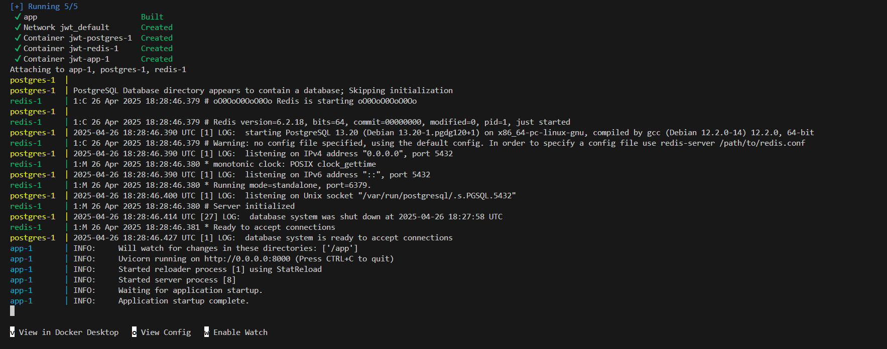

Для наглядной работы с backend-сервисами, будем использовать postman.
Заходим по адресу http://localhost:8000/docs#/ и копируем содержимое /openapi.json в postman.

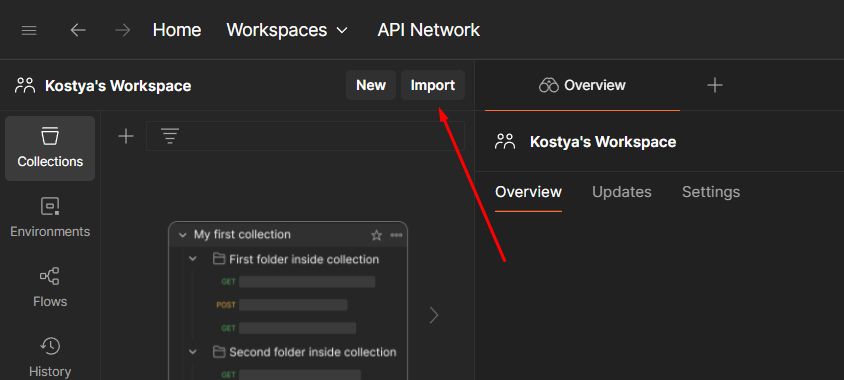

Добавляем в variables адрес хоста.
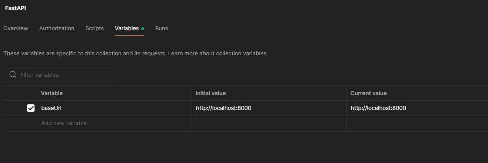

Получаем следующую структуру.
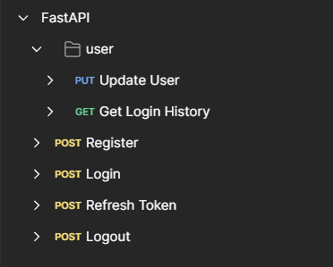

---
Начнем проверку эндпоинтов с регистрации пользователя 

1. Регистрация пользователя

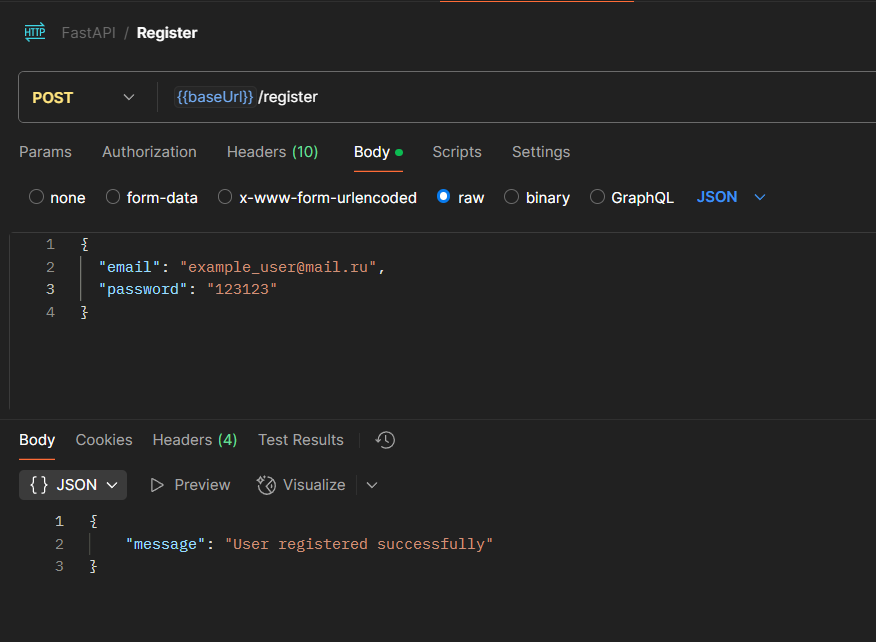

Как видно - регистрация прошла успешно.

2. Аутентификация пользователя

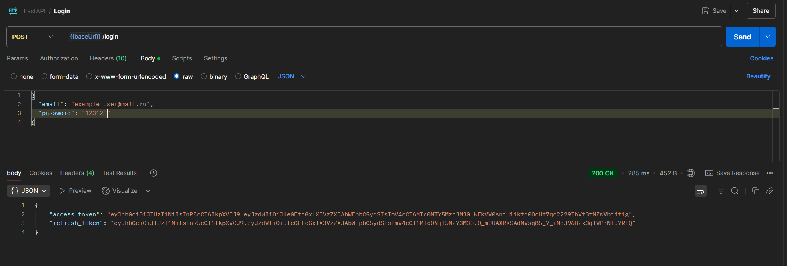

После входа пользователя в "систему" ему присваиваются личные access и refresh-токены.

Посмотрим login history, после чего обновим пароль у пользователя и проверим произошли ли изменения в login history.

3. Login history

Введя access-токен пользователя - получаем информацию о его входах в "систему".
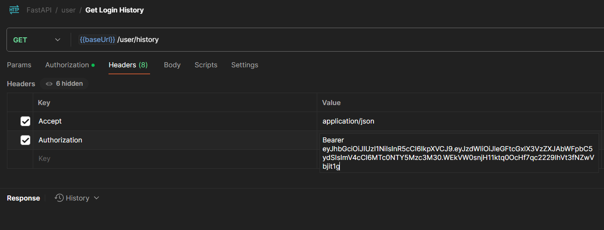

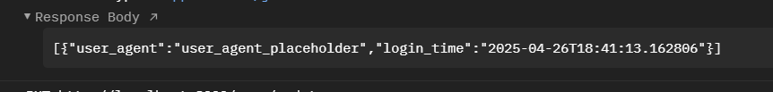

4. Изменение данных пользователя

Аналогично с прошлым пунктом введя access-токен пользователя - успешно обновляем пароль на "12345".

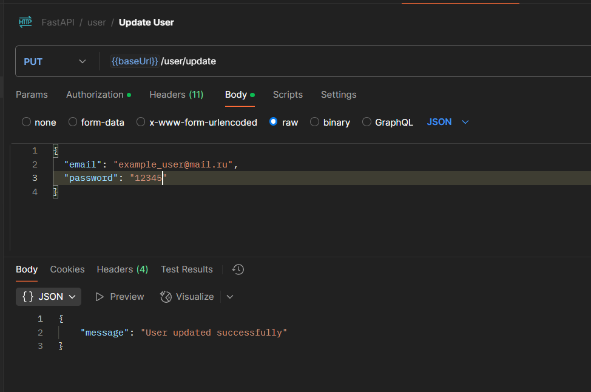

5. Обновим токен

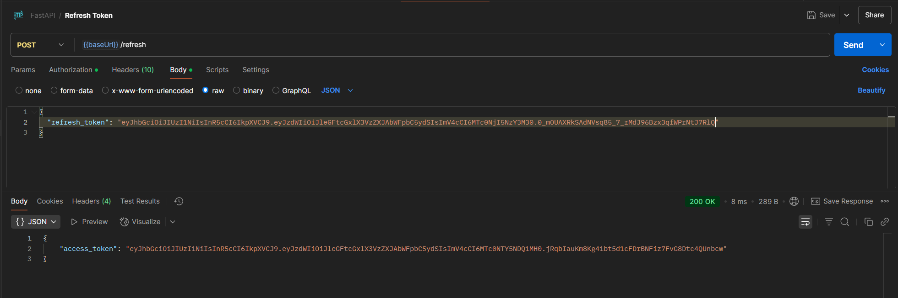

6. Выйдем из "системы"

Выходим из аккаунта, введя обновленный access-токен 

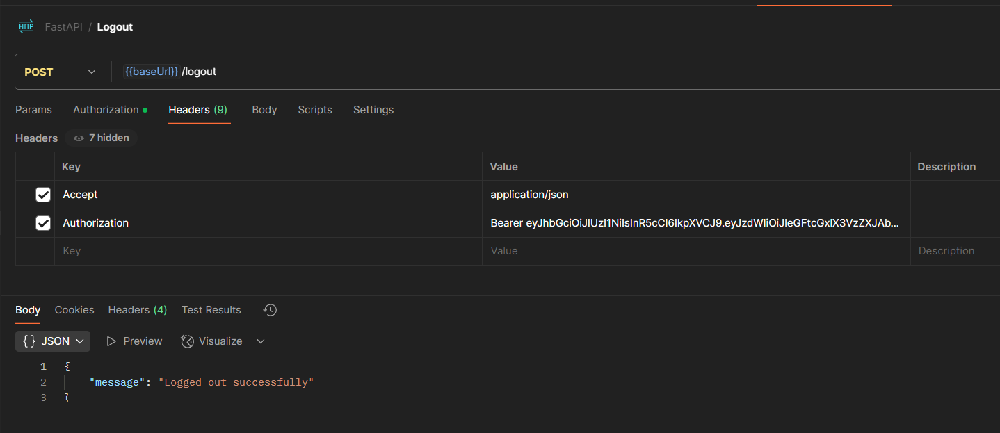

7. Заново войдем в аккаунт и посмотрим историю входов

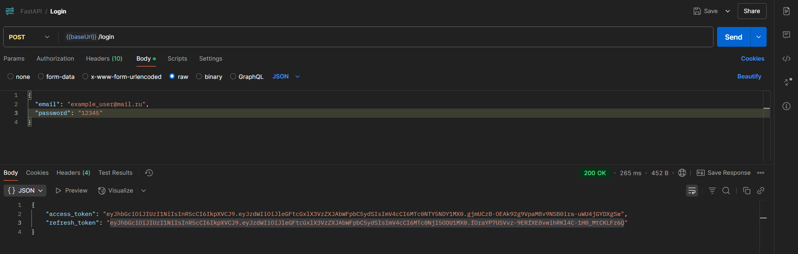
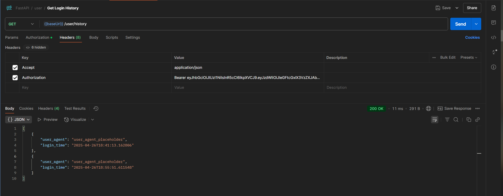

Как видно из фото выше - в истории сохранилось два логина в систему, как и было произведено фактически. 
Auth-сервис работает корректно.

